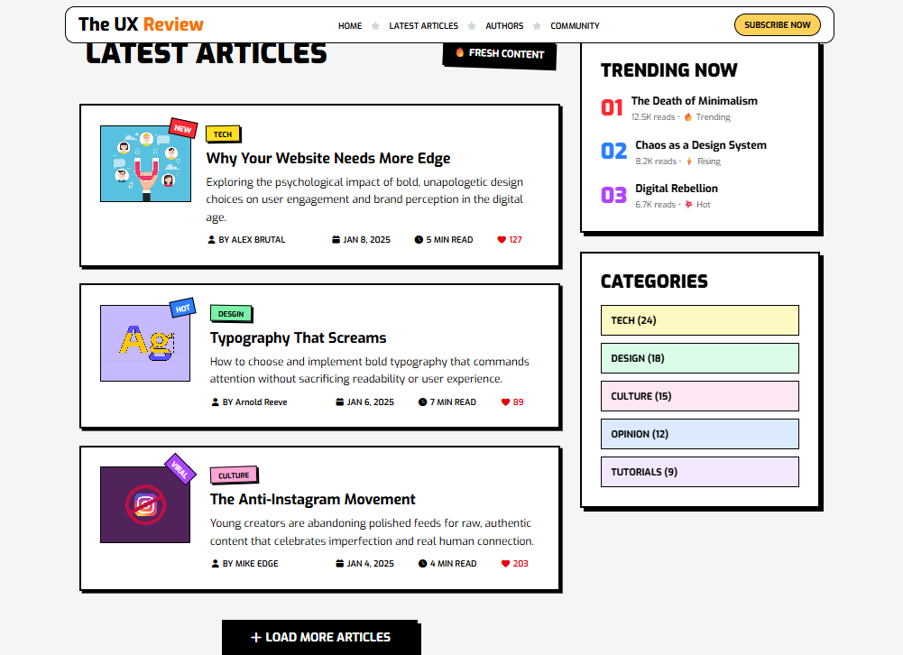
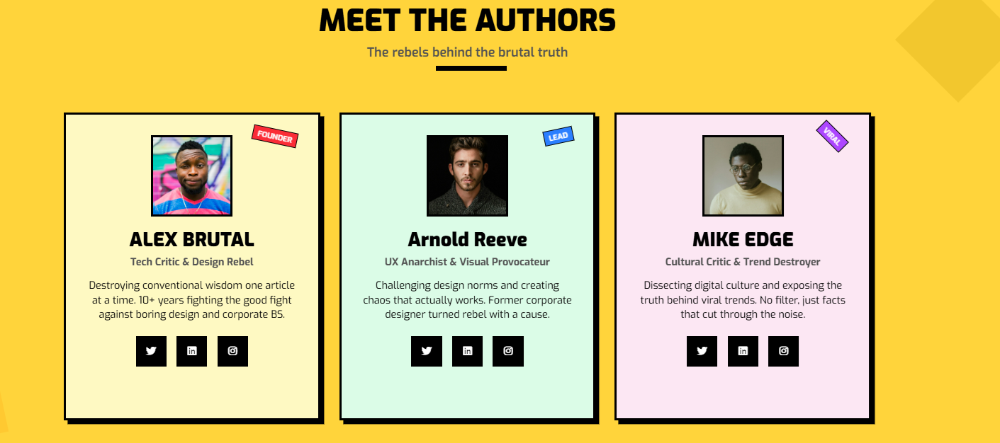
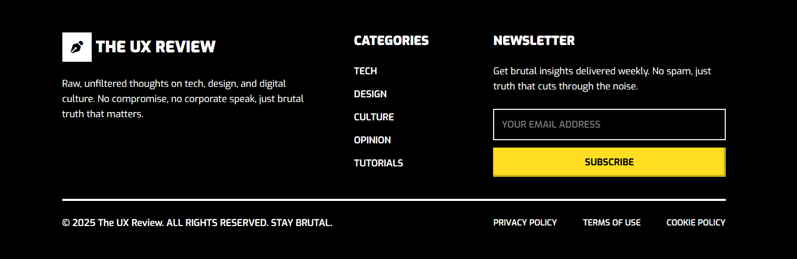

# 📰 The UX Review Blog

A modern, responsive front-end blog layout focused on **User Experience (UX)** design.  
Built entirely with **HTML** and **CSS**, featuring a minimal, elegant interface and mobile-friendly navigation.

**Live demo:** [https://the-ux-review-blog.netlify.app/](https://the-ux-review-blog.netlify.app/)
---

## ✨ Features

- 📱 **Responsive design** — works seamlessly across desktop and mobile  
- 🎨 **Clean layout** with well-structured sections  
- 🧭 **Mobile navigation menu** with smooth slide-in animation  
- 🔍 **Section-based navigation** (Hero, Latest Articles, Authors, Community)  
- 🌑 **Modern typography and spacing system**  
- ⚙️ **Font Awesome icons** for visual enhancement  

---

## 🧩 Sections Overview

- **Header** — logo, navigation menu, and subscribe button  
- **Hero Section** — main introduction area  
- **Latest Articles** — preview of the latest UX articles  
- **Meet the Authors** — highlights of contributing authors  
- **Join the Rebellion** — community and subscription call-to-action  
- **Footer** — minimal closing section

---

## 🛠️ Tech Stack

| Tool | Description |
|------|--------------|
| **HTML5** | Markup and structure |
| **CSS3** | Styling and responsive layout |
| **Font Awesome** | Icon library |
---

## 📸 Screenshots

### 🖼️ HERO SECTION

### 🖼️ LATEST ARTICLES  

### 🖼️ MEET THE AUTHORS 

### 🖼️ JOIN THE REBELLION 

### 🖼️ FOOTER

