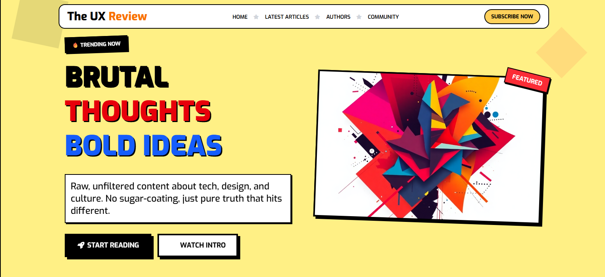

# 🚁 Drone Product Landing Page – DJI Mavic 4 Pro

A **modern product landing page** for the **DJI Mavic 4 Pro** drone. This front-end project is designed to simulate a professional e-commerce product page, with interactive elements, comparisons, reviews, and accessory recommendations.

---

## 📌 Features

- 🔝 Sticky navigation with smooth anchor scrolling
- 🎯 Hero section with promotional pricing and product badges
- 📊 Detailed comparison table vs competitor drones
- ⭐ Customer rating breakdown and verified reviews
- 🧩 Accessory & related product section
- 💡 Built with **HTML5**, **CSS3**, and **Font Awesome**

---

## 📸 Screenshots

### 🖼️ Hero Section  

### 🖼️ Specifications Comparison  

### 🖼️ Reviews & Ratings  

### 🖼️ Related Products  

